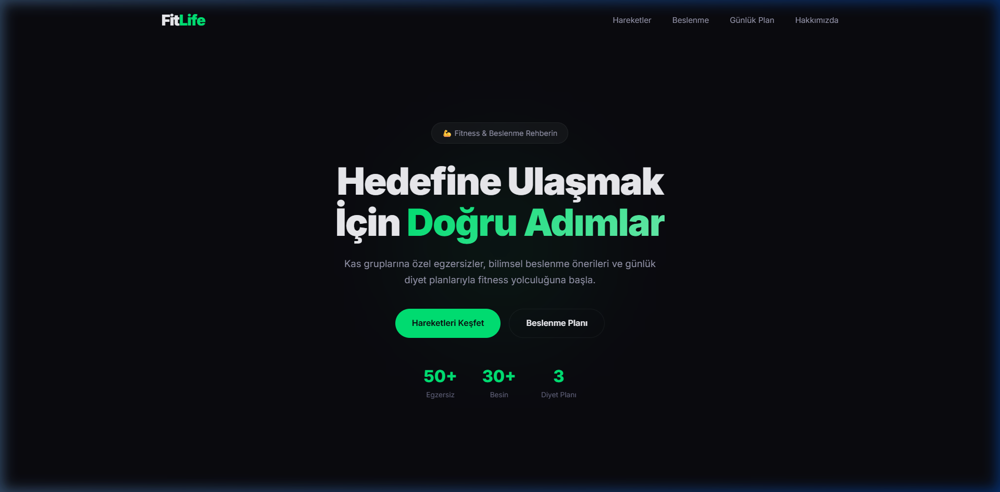
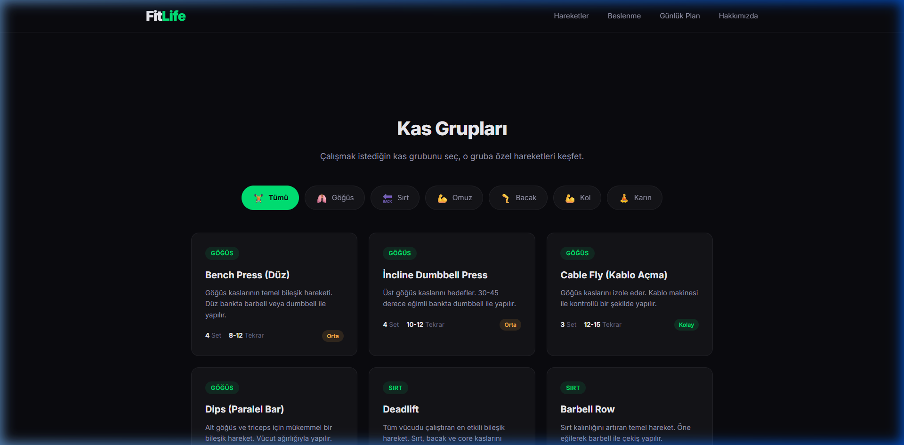
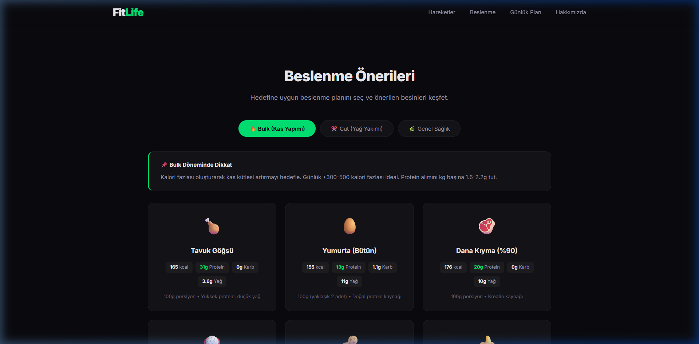

# 💪 FitLife — Gym Exercises & Nutrition Guide

A comprehensive fitness and nutrition reference site with 50+ exercises organized by muscle group, detailed macro breakdowns for 30+ foods, and daily meal plans for bulking, cutting, and general health.



## ✨ Features

- **7 Muscle Groups** — Chest, Back, Shoulders, Legs, Arms, Abs with filtered exercise cards
- **50+ Exercises** — Each with sets, reps, and difficulty ratings
- **Nutrition Plans** — Bulk, Cut, and General Health tabs with macro details
- **Daily Meal Plan** — Complete 6-meal schedule with calorie & protein totals
- **Premium Dark UI** — Neon green accents, glassmorphism, smooth animations
- **Responsive Design** — Works on desktop, tablet, and mobile

## 🏋️ Exercise Cards

Filter exercises by muscle group with interactive buttons. Each card shows:



- Exercise name and description
- Number of sets and reps
- Difficulty level (Easy / Medium / Hard)

## 🥗 Nutrition Guide

Detailed macro breakdowns per 100g with three diet plan tabs:



- 🔥 **Bulk** — High-calorie foods for muscle gain
- ✂️ **Cut** — Low-calorie foods for fat loss
- 🌿 **General Health** — Balanced nutrition essentials

## 🛠️ Tech Stack

| Technology | Purpose |
|---|---|
| HTML5 | Semantic structure |
| CSS3 | Dark theme, animations, glassmorphism |
| JavaScript | Filtering, tab switching, scroll animations |
| Inter Font | Modern typography |
| Lucide Icons | UI icons |

## 🚀 Getting Started

```bash
# Clone the repo
git clone https://github.com/sensamet/fitlife.git
cd fitlife

# Open in browser
open index.html
```

No build step required — just open `index.html` in your browser.

## 📁 Project Structure

```
├── index.html      # Main HTML with all content
├── style.css       # Premium dark theme styles
├── app.js          # Filtering, tabs & animations
└── screenshots/    # README images
```

## 📄 License

MIT
